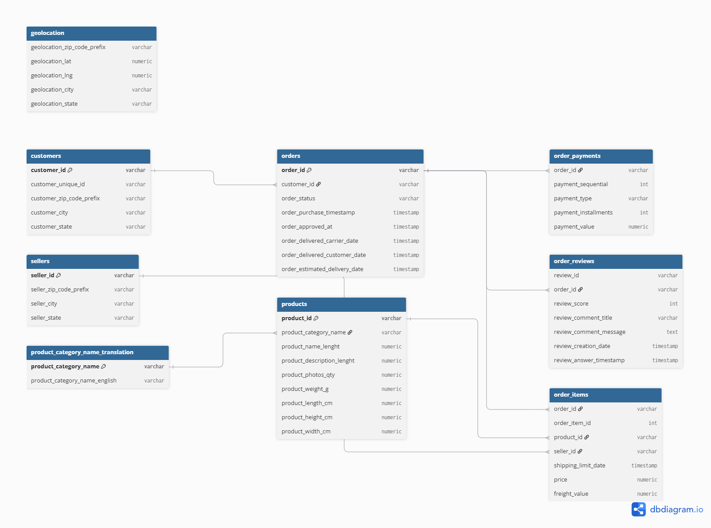

# Olist E-Commerce Analytics — End-to-End Business Analysis

An end-to-end data analytics project using PostgreSQL, Python, and Power BI to analyze 100K+ orders from Olist, a Brazilian e-commerce marketplace. This project covers database design, data cleaning, SQL analysis (including window functions, cohort analysis, and RFM segmentation), and a business-facing dashboard.

## Tech Stack
- **Database:** PostgreSQL
- **Analysis:** SQL (CTEs, window functions, views), Python (pandas)
- **Visualization:** Power BI
- **Version Control:** Git/GitHub

## Database Schema

9 relational tables covering customers, orders, order items, payments, reviews, products, sellers, and geolocation data.

## Dataset
This project uses the [Olist Brazilian E-Commerce dataset](https://www.kaggle.com/datasets/olistbr/brazilian-ecommerce) from Kaggle. Download it and place the CSVs in a `data/` folder to reproduce this analysis.

## Project Structure

sql/ -- All SQL scripts (schema, cleaning, analysis, views)
notebooks/ -- Python data cleaning and profiling notebook
dashboard/ -- Power BI dashboard file
images/ -- ERD diagram and dashboard screenshots

## Business Problem

Olist's leadership wants to understand what's driving customer behavior, operational performance, and revenue growth to prioritize where to invest next — in retention, logistics, or acquisition.

## Approach

Built a full relational database from Olist's raw e-commerce data (9 tables, ~100K orders), profiled and cleaned it in Python, then analyzed it across five dimensions using SQL (CTEs, window functions, views) and visualized results in an interactive Power BI dashboard.

## Key Findings

### 1. Revenue is growing strongly, with clear seasonality
Monthly revenue grew from ~₹127K (Jan 2017) to consistently over ₹1M/month by 2018. November 2017 saw a **+53.57% month-over-month spike**, consistent with Black Friday seasonality, followed by a sharp -26.90% pullback in December — a predictable post-peak normalization worth planning inventory and staffing around.

### 2. Olist is a one-time-purchase marketplace, not a repeat-customer business
Cohort retention analysis reveals month-1 repeat purchase rates **never exceed 0.72%** across any cohort (weighted average: **0.48%**). This reframes every other customer finding: RFM "Champions" and "Loyal Customers" are relative outliers in an ecosystem where repeat purchasing is structurally rare. CLV analysis confirms this — 89% of customers are "Low Value" (avg ₹111 spend), and nearly every top-spending customer made only one purchase.

**Implication:** Retention campaigns face an unusually low ceiling here. Investment is likely better spent on acquisition efficiency and maximizing per-transaction value (upsells, bundling) rather than repeat-purchase loyalty programs.

### 3. A meaningful "At-Risk" high-value segment exists despite low overall retention
RFM segmentation across 93K+ customers found **24% (22,957 customers) are "At Risk"** — high past value (avg ₹241 spend) but currently inactive. Even within a low-retention business, this is the single highest-leverage segment for a targeted win-back campaign.

### 4. Late delivery has a severe, measurable impact on customer satisfaction
While average delivery beats estimates by ~11 days, this hides a genuine **8.11% late-delivery segment** (7,826 orders). Late orders average **2.57 stars** vs **4.29 stars** for on-time orders — a **1.72-star (40%) gap** directly tied to delivery performance.

### 5. Delivery delays are geographically concentrated, not evenly distributed
Late-delivery rates range from 2.89% (Rondônia) to 23.37% (Alagoas), with Northeastern Brazil consistently underperforming. Notably, **Rio de Janeiro** — a top-5 order-volume state — shows a **13.30% late rate**, more than double São Paulo's 5.82%, despite comparable infrastructure. Zip-code-level analysis shows this is even more concentrated than the state view suggests, with specific RJ and Campinas (SP) zip codes showing late rates above 30%.

### 6. One seller shows a red-flag quality gap despite high revenue
Among the top 15 sellers by revenue, one (973 orders, #5 by revenue) shows an average review score of **3.35** — a full point below peers, who average 3.8+. This is a candidate for platform-level quality review before further scaling.

## Business Recommendations

1. **Prioritize win-back campaigns for the 24% "At-Risk" segment** — highest-value, lowest-effort retention opportunity given the segment's proven past spend.
2. **Do not over-invest in broad retention/loyalty programs** — given the near-zero baseline repeat-purchase rate, focus growth strategy on acquisition efficiency and average-order-value optimization instead.
3. **Investigate logistics specifically in Rio de Janeiro and Northeastern states** (AL, MA, PI, CE, SE) — these show late-delivery rates 2-4x the national average, directly costing ~1.7 stars in customer satisfaction per late order.
4. **Flag seller [ID] for quality review** — high revenue but significantly below-average customer satisfaction; early intervention could prevent larger reputational risk as this seller scales.
5. **Plan inventory and staffing around the November seasonal spike** — Black Friday-driven demand consistently outpaces other months by 50%+.

## Dashboard

An interactive 5-page Power BI dashboard was built to explore these findings:
1. **Executive Summary** — revenue trends and top-line KPIs
2. **Customer Insights** — RFM segmentation and geographic distribution
3. **Cohort & Retention** — retention curves and CLV tier breakdown
4. **Operations & Delivery** — delivery performance and regional risk map
5. **Product & Seller Performance** — category and seller rankings

*(Full .pbix file available in the `dashboard/` folder)*

## Data Quality & Engineering Notes

- Resolved 2 missing category mappings and 1 character-encoding issue during import (see `sql/02_data_quality_fixes.sql`)
- Full Python-based data profiling across all 9 tables — no systemic quality issues beyond the above (see `notebooks/01_data_cleaning.ipynb`)
- Core analytical queries converted to PostgreSQL Views for reusability (`sql/10_views.sql`)
- Query performance reviewed via `EXPLAIN ANALYZE`; documented tradeoff decisions on indexing vs. query frequency